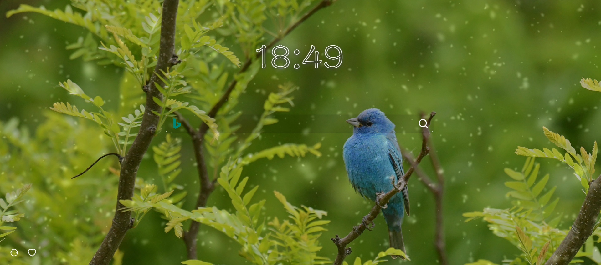
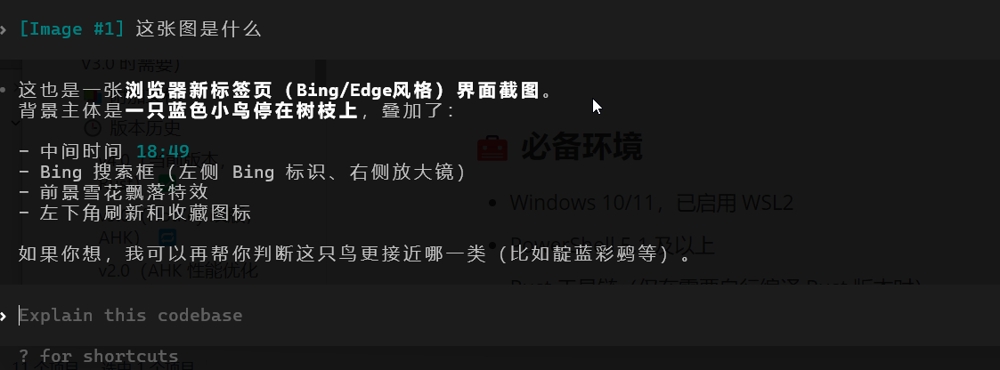
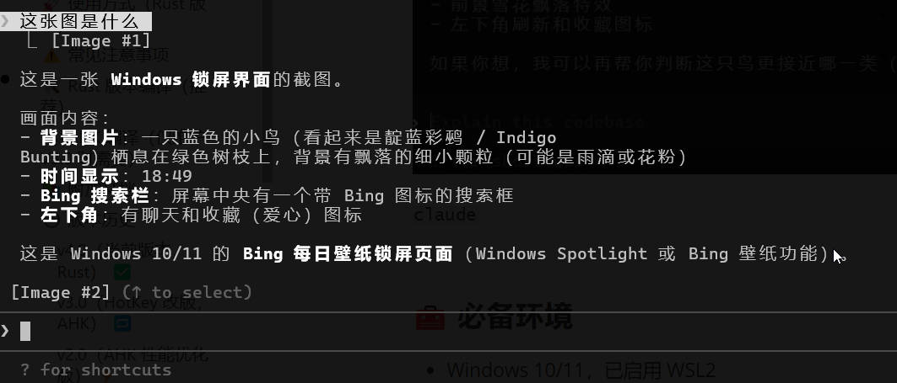
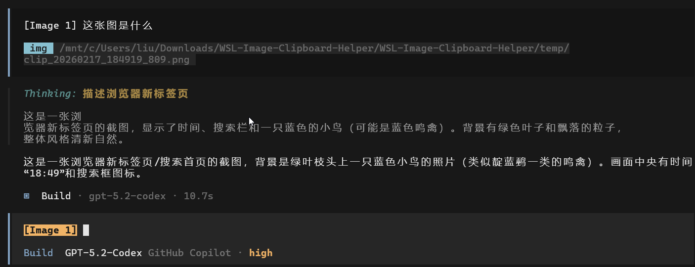

# WSL Image Clipboard Helper

Language: [中文说明](#中文说明) | [English Guide](#english-guide)

---

## 中文说明 🇨🇳

### 📌 概述

#### 🌍 背景
当前许多智能编程 CLI Agent（如 Codex、Amazon Q Developer CLI、OpenCode、Claude Code 等）主要针对 Linux 和 macOS 系统优化，Windows 用户想要体验这些工具，通常需要通过 WSL2（Windows Subsystem for Linux 2）来运行。然而，WSL2 在某些能力上的支持并不完善，图片粘贴就是其中一个典型痛点：

- 问题：WSL2 终端无法直接访问 Windows 剪贴板中的图片数据
- 影响：用户无法像在原生 Linux/macOS 中那样，直接把截图粘贴给 AI 工具分析
- 现状：部分 AI CLI 工具通过“保存图片到文件 -> 传递文件路径”的方式变相支持图片输入

#### ✅ 解决方案
本工具用于弥补这个缺口：通过全局快捷键（默认 `Alt+V`），自动读取 Windows 剪贴板图片，保存到本地 `temp/` 目录，并把对应 WSL 路径（`/mnt/c/...`）粘贴到当前输入窗口，让 AI 工具可以直接消费图片文件。

当前主版本是 Rust 实现（`v4.0`），在保持原有使用习惯的前提下，重点提升稳定性与可维护性。

### ✨ 核心特性

- 🚀 即时路径输出：触发热键后优先粘贴 `/mnt/...` 路径，减少等待时间
- ⚡ 图片异步保存：路径先可用，图片文件后台写入，降低主流程阻塞
- 🌐 输入法保护（安全模式）：粘贴前切英文输入法，结束后自动恢复
- 🧹 自动清理机制：周期清理过期 PNG，退出时清理临时图片
- 🖱️ 托盘管理：支持切换热键、切换运行模式、打开临时图片目录、退出并清理临时图片
- 🛡️ 图片读取边界保护：对 DIB 头与内存大小做安全校验，避免异常数据导致崩溃



以这张图为例子，粘贴到Codex,Claude Code,OpenCode均正常(其他Agent工具可自行尝试)，粘贴的时候会自动识别成`[Image #n]` 的这种格式，不能转换成这个格式的时候，就会以路径的形式显示在输入框中

`codex`



`claude`



`openCode`



### 🧰 必备环境

- Windows 10/11，已启用 WSL2
- PowerShell 5.1 及以上
- Rust 工具链（仅在需要自行编译 Rust 版本时）
- AutoHotkey v2（仅在维护旧版 AHK 流程或自编 AHK 可执行文件时）

### 🗂️ 目录结构

```text
WSL-Image-Clipboard-Helper/
├── README.md
├── docs/                    # 文档记录
│   ├── architecture_by_codex.md
│   ├── terminal-ctrl-v-interception.md
│   └── rust-refactor-v3-v4.md
├── rust/                    # rust重构版本
│   ├── Cargo.toml
│   ├── Cargo.lock
│   ├── wsl_clipboard.toml
│   └── src/                 # rust重构版本核心代码
├── scripts/                 # AHK 相关脚本与历史可执行文件
```

### 🚀 使用方式（Rust 版本）

1. 最简单方式（推荐）：从 Releases 下载已编译 `wsl_clipboard.exe`：  
   [https://github.com/cpulxb/WSL-Image-Clipboard-Helper/releases](https://github.com/cpulxb/WSL-Image-Clipboard-Helper/releases)

2. 将下载的 `wsl_clipboard.exe` 放到一个固定目录。

   Releases 压缩包中文件目录

   ```
   WSL-Image-Clipboard-Helper/
   ├── wsl_clipboard.exe        # 推荐直接使用的预编译可执行文件（rust版本)
   ├── temp/                    # 运行时临时图片目录
   ├── wsl_clipboard.toml       # 运行时自动生成，存储相关配置，不要删除
   ```

3. 双击启动 `wsl_clipboard.exe`。

4. 在任意可编辑输入框按下快捷键（默认 `Alt+V`）：
   - 有图片：保存到 `temp/`，并粘贴 `/mnt/...` 路径
   - 无图片：自动回退普通粘贴（`Ctrl+V`）

5. 通过托盘菜单切换热键与运行模式。

6. 退出时从托盘菜单选择 `退出并清理临时图片`，会删除 `temp/` 下的临时 PNG 文件。

如需自行编译，再使用下面的源码方式：

1. 克隆仓库并进入目录：
   ```bash
   git clone https://github.com/cpulxb/WSL-Image-Clipboard-Helper.git
   cd WSL-Image-Clipboard-Helper
   ```
2. 按下文“Rust 版本编译（推荐）”完成编译。
3. 启动编译产物 `wsl_clipboard.exe`。

### ⚠️ 常见注意事项

- 默认热键是 `Alt+V`，可在托盘菜单中切换为 `Ctrl+Alt+V` 或 `Alt+Enter`
- 运行配置保存在 `wsl_clipboard.toml`（与可执行文件同目录）
- 托盘菜单中的 `退出并清理临时图片` 会删除 `temp/` 下的临时 PNG 文件
- 若遇到输入法导致的粘贴错乱，切回 `兼容模式（输入法保护）`
- 若托盘图标未显示，请检查任务栏隐藏图标区域

### 🛠️ Rust 版本编译（推荐）

在仓库根目录执行：

```bash
cd rust
cargo build --release --target x86_64-pc-windows-msvc
```

编译产物：

```text
rust/target/x86_64-pc-windows-msvc/release/wsl_clipboard.exe
```

调试构建：

```bash
cd rust
cargo build --target x86_64-pc-windows-msvc
```

清理构建产物：

```bash
cd rust
cargo clean
```

### 🔧 AHK 编译（仅维护 V3.0 时需要）

如果你在维护 `v3.0` 的 AHK 分支，可用 Ahk2Exe 重新编译：

1. 安装 AutoHotkey v2：  
   [https://www.autohotkey.com/download/ahk-v2.exe](https://www.autohotkey.com/download/ahk-v2.exe)
2. 打开 `C:\Program Files\AutoHotkey\Compiler\Ahk2Exe.exe`
3. Source 选择 `scripts/wsl_clipboard.ahk`
4. Destination 选择输出路径（例如 `scripts/wsl_clipboard.exe`）
5. Base File 建议使用 `AutoHotkey64.exe`

### 📚 附加文档

- [技术架构与流程说明](docs/architecture_by_codex.md)
- [V3.0/V4.0 重构说明](docs/rust-refactor-v3-v4.md)

### 🕒 版本历史

#### v4.0（当前版本，Rust） ✅

- 主流程迁移到 Rust，可维护性更高
- 修复 DIB 像素偏移解析问题，提升图片兼容性
- 增加剪贴板内存边界校验，避免越界读取风险
- 热键切换加入回滚机制，避免切换失败后无热键可用
- 异常分支补齐剪贴板释放，降低资源占用风险

#### v3.0（HotKey 改版，AHK） 🔁

- 仍基于 AHK 体系
- 重点优化热键体验与可配置性
- 托盘交互进一步完善

#### v2.0（AHK 性能优化版） ⚡

- 路径优先异步保存，体感延迟明显下降
- 引入输入法保护和自动清理机制

#### v1.0 🧱

- 基础剪贴板图片同步能力
- SHA256 去重与缓存管理

---

## English Guide 🌐

### 📌 Overview

#### 🌍 Background
Many AI CLI agents (Codex, Amazon Q Developer CLI, OpenCode, Claude Code, etc.) are optimized for Linux/macOS workflows. On Windows, users usually rely on WSL2, but clipboard image handling is still a practical gap:

- Problem: WSL2 terminals cannot directly consume image bytes from Windows clipboard
- Impact: screenshot-to-agent flow is less direct than native Linux/macOS
- Workaround: save image to file and pass file path to the tool

#### ✅ Solution
This project automates that workaround with a global hotkey (default `Alt+V`): it captures clipboard image data, saves a PNG file, and pastes the WSL path (`/mnt/...`) into the active input control.

Current mainline release is Rust-based (`v4.0`), focused on reliability and maintainability.

### ✨ Highlights

- 🚀 Fast path-first paste workflow
- ⚡ Async image persistence
- 🌐 IME guard in safe mode
- 🖱️ Tray-based hotkey and mode switching
- 🧹 Automatic cleanup for temporary PNG files
- 🛡️ Safer clipboard parsing with memory-bound checks


Using this image as an example, pasting works correctly in Codex, Claude Code, and OpenCode (you can also try other agent tools). During paste, many tools render it as `[Image #n]`; when that rendering path is unavailable, the input falls back to showing the file path in the text box.

`codex`


`claude`


`openCode`


### 🧰 Requirements

- Windows 10/11 with WSL2
- PowerShell 5.1+
- Rust toolchain (for building Rust version)
- AutoHotkey v2 (only for maintaining AHK-based `v3.0`)

### 🗂️ Directory Structure

```text
WSL-Image-Clipboard-Helper/
├── README.md
├── docs/
│   ├── architecture_by_codex.md
│   ├── terminal-ctrl-v-interception.md
│   └── rust-refactor-v3-v4.md
├── rust/
│   ├── Cargo.toml
│   ├── Cargo.lock
│   ├── wsl_clipboard.toml
│   └── src/
├── scripts/                 # AHK scripts and legacy executable
├── temp/                    # runtime temporary image directory
└── wsl_clipboard.exe        # recommended prebuilt executable
```

### 🚀 Usage (Rust version)

1. Easiest way (recommended): download prebuilt `wsl_clipboard.exe` from Releases:  
   [https://github.com/cpulxb/WSL-Image-Clipboard-Helper/releases](https://github.com/cpulxb/WSL-Image-Clipboard-Helper/releases)
2. Put `wsl_clipboard.exe` in a fixed folder (ideally with `temp/` and `wsl_clipboard.toml`).
3. Launch `wsl_clipboard.exe`.
4. Press hotkey (default `Alt+V`) in any editable field:
   - With image in clipboard: save to `temp/` and paste the `/mnt/...` path.
   - Without image in clipboard: automatically fall back to normal paste (`Ctrl+V`).
5. Use the tray menu for hotkey/mode switch and choose `Exit and clean temporary images` when exiting.

### ⚠️ Notes

- The default hotkey is `Alt+V`; the tray menu can switch it to `Ctrl+Alt+V` or `Alt+Enter`.
- Runtime settings are stored in `wsl_clipboard.toml` next to the executable.
- `Exit and clean temporary images` removes temporary PNG files under `temp/`.
- If IME state causes paste issues, switch back to `Compatibility mode (IME guard)`.
- If the tray icon is not visible, check the hidden icons area in the Windows taskbar.

If you prefer building from source:

1. Clone repository:
   ```bash
   git clone https://github.com/cpulxb/WSL-Image-Clipboard-Helper.git
   cd WSL-Image-Clipboard-Helper
   ```
2. Build with the commands in the next section.
3. Launch the built `wsl_clipboard.exe`.

### 🛠️ Build (Rust)

```bash
cd rust
cargo build --release --target x86_64-pc-windows-msvc
```

Binary output:

```text
rust/target/x86_64-pc-windows-msvc/release/wsl_clipboard.exe
```

Clean build artifacts:

```bash
cd rust
cargo clean
```

### 🕒 Version Line

- `v4.0`: Rust mainline release (current)
- `v3.0`: Hotkey-focused revision on AHK
- `v2.0`: AHK path-first optimization
- `v1.0`: AHK baseline

### 📚 Additional Resources

- [Architecture & Workflow Details](docs/architecture_by_codex.md)
- [V3.0/V4.0 Refactor Notes](docs/rust-refactor-v3-v4.md)
