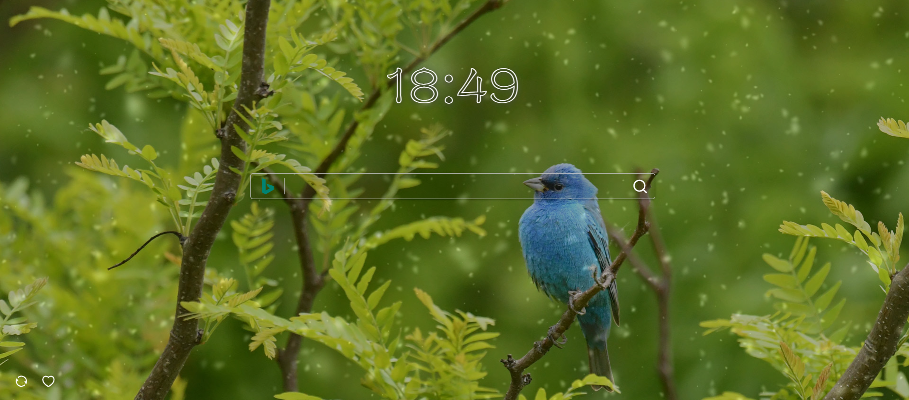
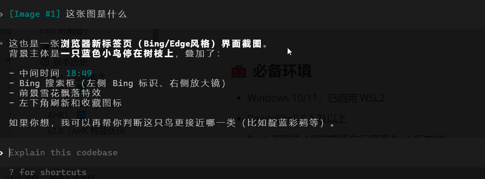
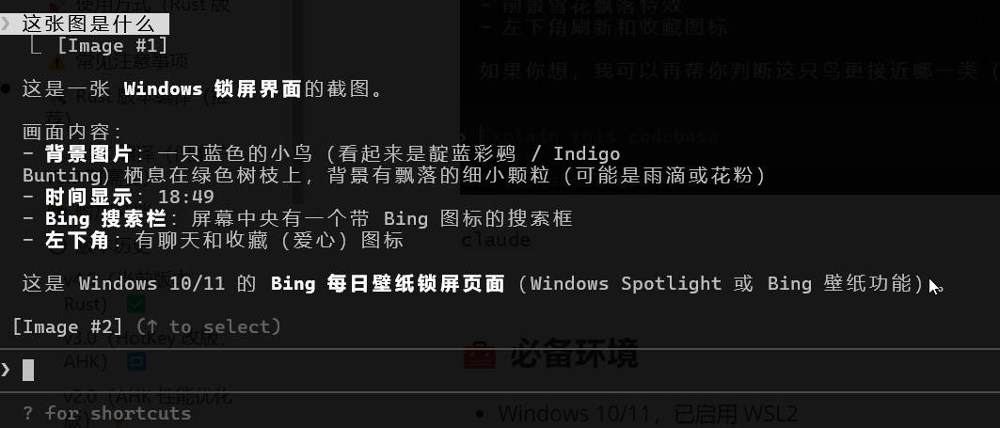
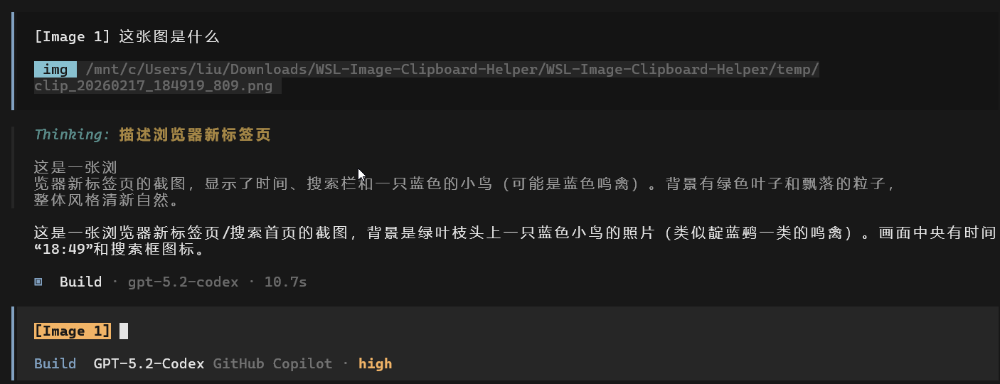

<a id="wsl-image-clipboard-helper"></a>

<p align="center">
  
</p>

<h1 align="center">WSL Image Clipboard Helper</h1>

<p align="center">
  One hotkey to turn Windows clipboard images into WSL-ready paths for AI CLI tools.
</p>

<p align="center">
  <a href="https://github.com/cpulxb/WSL-Image-Clipboard-Helper/releases/latest">Release</a>
  ·
  <a href="#中文说明">中文</a>
  ·
  <a href="#english-guide">English</a>
</p>

---

## 中文说明 🇨🇳

### 📌 概述

#### 🌍 背景
当前许多智能编程 CLI Agent（如 Codex、Amazon Q Developer CLI、OpenCode、Claude Code 等）主要针对 Linux 和 macOS 系统优化，Windows 用户想要体验这些工具，通常需要通过 WSL2（Windows Subsystem for Linux 2）来运行。然而，WSL2 在某些能力上的支持并不完善，图片粘贴就是其中一个典型痛点：

- 问题：WSL2 终端无法直接访问 Windows 剪贴板中的图片数据
- 影响：用户无法像在原生 Linux/macOS 中那样，直接把截图粘贴给 AI 工具分析
- 现状：部分 AI CLI 工具通过“保存图片到文件 -> 传递文件路径”的方式变相支持图片输入

#### ✅ 解决方案
本工具用于弥补这个缺口：通过全局快捷键（默认 `Alt+V`），自动读取 Windows 剪贴板图片，保存到本地 `temp/` 目录，并把对应 WSL 路径（`/mnt/c/...`）粘贴到当前输入窗口，让 AI 工具可以直接消费图片文件。

当前主版本是 Rust 实现（`v4.0`）。推荐直接下载 GitHub Release `v4.0` 或 latest release 中的预编译版本。

### ✨ 核心特性

- 🚀 即时路径输出：触发热键后优先粘贴 `/mnt/...` 路径，减少等待时间
- ⚡ 图片异步保存：路径先可用，图片文件后台写入，降低主流程阻塞
- 🌐 输入法保护（安全模式）：粘贴前切英文输入法，结束后自动恢复
- 🧹 自动清理机制：周期清理过期 PNG，退出时清理临时图片
- 🖱️ 托盘管理：支持切换热键、切换运行模式、打开临时图片目录、退出并清理临时图片
- 🛡️ 图片读取边界保护：对 DIB 头与内存大小做安全校验，避免异常数据导致崩溃
- 🪟 Windows 集成：内嵌多尺寸图标，并带 DPI-aware manifest，高 DPI 环境显示更稳定
- 📁 Explorer 路径转换：在资源管理器复制文件后按 `Alt+V`，会粘贴对应 `/mnt/...` 路径
- 🎯 路径格式可切换：纯路径 / `@` 前缀（适配 Kimi Code CLI、Gemini CLI、Qwen Code）/ 引号包裹



以这张图为例子，粘贴到Codex,Claude Code,OpenCode均正常(其他Agent工具可自行尝试)，粘贴的时候会自动识别成`[Image #n]` 的这种格式，不能转换成这个格式的时候，就会以路径的形式显示在输入框中

`codex`



`claude`



`openCode`



### 🧰 必备环境

- Windows 10/11，已启用 WSL2
- PowerShell 5.1 及以上
- Rust 工具链（仅在需要自行编译 Rust 版本时）
- AutoHotkey v2（仅在维护旧版 AHK 流程或自编 AHK 可执行文件时）

### 🗂️ 目录结构

```text
WSL-Image-Clipboard-Helper/
├── README.md
├── docs/                    # 文档记录
│   ├── architecture_by_codex.md
│   ├── terminal-ctrl-v-interception.md
│   └── rust-refactor-v3-v4.md
├── rust/                    # rust重构版本
│   ├── Cargo.toml
│   ├── Cargo.lock
│   ├── wsl_clipboard.toml
│   └── src/                 # rust重构版本核心代码
├── scripts/                 # AHK 相关脚本与历史可执行文件
```

### 🚀 使用方式（Rust 版本）

1. 最简单方式（推荐）：从 GitHub Release 下载已编译版本：
   - `v4.0`：[https://github.com/cpulxb/WSL-Image-Clipboard-Helper/releases/tag/v4.0](https://github.com/cpulxb/WSL-Image-Clipboard-Helper/releases/tag/v4.0)
   - latest release：[https://github.com/cpulxb/WSL-Image-Clipboard-Helper/releases/latest](https://github.com/cpulxb/WSL-Image-Clipboard-Helper/releases/latest)

2. 将下载的 `wsl_clipboard.exe` 放到一个固定目录。

   Releases 压缩包中文件目录

   ```
   WSL-Image-Clipboard-Helper/
   ├── wsl_clipboard.exe        # 推荐直接使用的预编译可执行文件（rust版本)
   ├── temp/                    # 运行时临时图片目录
   ├── wsl_clipboard.toml       # 运行时自动生成，存储相关配置，不要删除
   ```

3. 双击启动 `wsl_clipboard.exe`。

4. 在任意可编辑输入框按下快捷键（默认 `Alt+V`）：
   - 有图片：保存到 `temp/`，并粘贴 `/mnt/...` 路径
   - 无图片：自动回退普通粘贴（`Ctrl+V`）
   - 在 Explorer 中先复制文件，再按 `Alt+V`：粘贴转换后的 WSL 路径（例如 `/mnt/c/...`）

5. 通过托盘菜单切换热键与运行模式。

6. 退出时从托盘菜单选择 `退出并清理临时图片`，会删除 `temp/` 下的临时 PNG 文件。

如需自行编译，再使用下面的源码方式：

1. 克隆仓库并进入目录：
   ```bash
   git clone https://github.com/cpulxb/WSL-Image-Clipboard-Helper.git
   cd WSL-Image-Clipboard-Helper
   ```
2. 按下文“Rust 版本编译（推荐）”完成编译。
3. 启动编译产物 `wsl_clipboard.exe`。

### ⚠️ 常见注意事项

- 默认热键是 `Alt+V`，可在托盘菜单中切换为 `Ctrl+Alt+V` 或 `Alt+Enter`
- 运行配置保存在 `wsl_clipboard.toml`（与可执行文件同目录）
- 托盘菜单中的 `退出并清理临时图片` 会删除 `temp/` 下的临时 PNG 文件
- 若遇到输入法导致的粘贴错乱，切回 `兼容模式（输入法保护）`
- 若托盘图标未显示，请检查任务栏隐藏图标区域
- 默认粘贴纯路径；Kimi 等需要 `@` 文件引用的 CLI，请在托盘菜单切换 `路径格式`

### ❓ 常见问题（FAQ）

**Q1：为什么有时显示 `[Image #1]`，有时却直接显示 `/mnt/...` 路径？**（[issue #4](https://github.com/cpulxb/WSL-Image-Clipboard-Helper/issues/4)）

CLI Agent（Claude Code / Codex / OpenCode 等）收到粘贴文本的瞬间会检查该路径的文件是否已存在：存在就渲染成 `[Image #n]` 并直接作为图片附件（无需申请读取权限）；不存在或识别失败就原样留下路径文本，之后 Agent 只能用读文件工具去访问（触发权限申请；若 Agent 跑在 Windows 原生环境而非 WSL，还可能因不认识 `/mnt/c/...` 而再转换一次 Windows 路径，出现"二次申请"）。

v4.0 及更早版本采用"先粘路径、后台再保存图片"的顺序，系统卡顿时文件落盘晚于 CLI 的检查，就会偶发直接显示路径。v4.1 起改为"先落盘、再粘贴"，从根本上消除该竞态。若仍偶发，请确认终端支持 bracketed paste（Windows Terminal 默认支持），并且 Agent 运行在 WSL 内。

**Q2：按了热键，图片保存了、输入法也切换了，但哪里都粘不出文本？**（[issue #2](https://github.com/cpulxb/WSL-Image-Clipboard-Helper/issues/2)）

按可能性从高到低排查：

1. **在用 v3.0 AHK 版本（或自行改编译的版本）**：旧版粘贴后固定 80ms 就把剪贴板恢复成原图片，目标窗口响应稍慢时读到的已是恢复后的图片数据，表现为"任何地方都粘不出文本"。请升级到 v4.x Rust 版本（已移除该竞态）。
2. **目标窗口以管理员权限运行**（如管理员终端），而本工具未提权：Windows UIPI 会静默拦截模拟按键。请以管理员身份运行本工具。
3. **热键修饰键未松开**：Alt 未抬起时注入的 Ctrl+V 会被识别成 Ctrl+Alt+V 而失效。v4.1 增加了物理按键释放等待与 Alt 菜单屏蔽键，已大幅缓解。
4. **安全软件拦截模拟键盘输入**（SendInput）：请将本工具加入白名单。

**Q3：Kimi Code CLI 里粘贴路径没有变成图片？**（[issue #5](https://github.com/cpulxb/WSL-Image-Clipboard-Helper/issues/5)）

Kimi Code CLI 不会把纯文本路径自动识别为图片，但支持 `@文件` 引用语法。在托盘菜单把 `路径格式` 切换为 `@ 路径（Kimi/Gemini/Qwen）`，热键会粘贴 `@/mnt/c/... `（带尾随空格），Kimi Code CLI / Gemini CLI / Qwen Code 即可把它作为文件引用消费。

另外注意：Kimi Code CLI 在 Windows 端自带 `Alt+V` 贴图快捷键，与本工具默认热键相同。本工具注册的是系统级全局热键、会优先生效；若想保留 Kimi 原生行为，可在托盘把本工具热键换成 `Ctrl+Alt+V`。

**Q4：路径里有空格，粘贴后被命令行截断？**

把 `路径格式` 切换为 `引号路径`，粘贴时会用双引号包裹每个路径。

### 🛠️ Rust 版本编译（推荐）

在仓库根目录执行：

```bash
cd rust
cargo build --release --target x86_64-pc-windows-msvc
```

编译产物：

```text
rust/target/x86_64-pc-windows-msvc/release/wsl_clipboard.exe
```

调试构建：

```bash
cd rust
cargo build --target x86_64-pc-windows-msvc
```

清理构建产物：

```bash
cd rust
cargo clean
```

在非 Windows 宿主（Linux/macOS）上执行 `cargo check` / `cargo clippy` 前，需先安装交叉编译 target（`rust/.cargo/config.toml` 默认指向 `x86_64-pc-windows-msvc`）：

```bash
rustup target add x86_64-pc-windows-msvc
```

### 🔧 AHK 编译（仅维护 V3.0 时需要）

如果你在维护 `v3.0` 的 AHK 分支，可用 Ahk2Exe 重新编译：

1. 安装 AutoHotkey v2：  
   [https://www.autohotkey.com/download/ahk-v2.exe](https://www.autohotkey.com/download/ahk-v2.exe)
2. 打开 `C:\Program Files\AutoHotkey\Compiler\Ahk2Exe.exe`
3. Source 选择 `scripts/wsl_clipboard.ahk`
4. Destination 选择输出路径（例如 `scripts/wsl_clipboard.exe`）
5. Base File 建议使用 `AutoHotkey64.exe`

### 📚 附加文档

- [技术架构与流程说明](docs/architecture_by_codex.md)
- [V3.0/V4.0 重构说明](docs/rust-refactor-v3-v4.md)
- [v4.1 终端图片粘贴场景实测报告](docs/paste-scenario-test-report.md)

### 🕒 版本历史

#### v4.1（开发中，Rust） 🚧

- 修复偶发"粘贴出原始路径而非 `[Image #n]`"：改为图片先落盘、路径后粘贴，消除文件存在性竞态（#4）
- 新增 `路径格式` 托盘选项：纯路径 / `@` 前缀 / 引号包裹，适配 Kimi Code CLI、Gemini CLI、Qwen Code 等（#5）
- 粘贴按键注入加固：等待物理修饰键释放、增加 Alt 菜单屏蔽键并释放右 Alt，降低"粘贴无内容"概率（#2）
- 支持在非 Windows 宿主上执行 `cargo check`/`cargo clippy`（自动跳过资源嵌入）
- README 新增 FAQ 排障章节

#### v4.0（当前发布版本，Rust） ✅

- 主流程迁移到 Rust，可维护性更高
- 修复 DIB 像素偏移解析问题，提升图片兼容性
- 增加剪贴板内存边界校验，避免越界读取风险
- 热键切换加入回滚机制，避免切换失败后无热键可用
- 异常分支补齐剪贴板释放，降低资源占用风险
- 内嵌多尺寸应用图标，并增加 DPI-aware manifest
- 支持 Explorer 复制文件后用 `Alt+V` 转换并粘贴 `/mnt/...` 路径

#### v3.0（HotKey 改版，AHK） 🔁

- 仍基于 AHK 体系
- 重点优化热键体验与可配置性
- 托盘交互进一步完善

#### v2.0（AHK 性能优化版） ⚡

- 路径优先异步保存，体感延迟明显下降
- 引入输入法保护和自动清理机制

#### v1.0 🧱

- 基础剪贴板图片同步能力
- SHA256 去重与缓存管理

---

## English Guide 🌐

### 📌 Overview

#### 🌍 Background
Many AI CLI agents (Codex, Amazon Q Developer CLI, OpenCode, Claude Code, etc.) are optimized for Linux/macOS workflows. On Windows, users usually rely on WSL2, but clipboard image handling is still a practical gap:

- Problem: WSL2 terminals cannot directly consume image bytes from Windows clipboard
- Impact: screenshot-to-agent flow is less direct than native Linux/macOS
- Workaround: save image to file and pass file path to the tool

#### ✅ Solution
This project automates that workaround with a global hotkey (default `Alt+V`): it captures clipboard image data, saves a PNG file, and pastes the WSL path (`/mnt/...`) into the active input control.

Current mainline release is Rust-based (`v4.0`). The recommended path is to download the prebuilt GitHub Release `v4.0` or the latest release.

### ✨ Highlights

- 🚀 Fast path-first paste workflow
- ⚡ Async image persistence
- 🌐 IME guard in safe mode
- 🖱️ Tray-based hotkey and mode switching
- 🧹 Automatic cleanup for temporary PNG files
- 🛡️ Safer clipboard parsing with memory-bound checks
- 🪟 Embedded multi-size app icons and a DPI-aware manifest
- 📁 Explorer file path conversion: copy files in Explorer, then press `Alt+V` to paste `/mnt/...` paths
- 🎯 Switchable path style: plain / `@`-prefixed (for Kimi Code CLI, Gemini CLI, Qwen Code) / quoted


Using this image as an example, pasting works correctly in Codex, Claude Code, and OpenCode (you can also try other agent tools). During paste, many tools render it as `[Image #n]`; when that rendering path is unavailable, the input falls back to showing the file path in the text box.

`codex`


`claude`


`openCode`


### 🧰 Requirements

- Windows 10/11 with WSL2
- PowerShell 5.1+
- Rust toolchain (for building Rust version)
- AutoHotkey v2 (only for maintaining AHK-based `v3.0`)

### 🗂️ Directory Structure

```text
WSL-Image-Clipboard-Helper/
├── README.md
├── docs/
│   ├── architecture_by_codex.md
│   ├── terminal-ctrl-v-interception.md
│   └── rust-refactor-v3-v4.md
├── rust/
│   ├── Cargo.toml
│   ├── Cargo.lock
│   ├── wsl_clipboard.toml
│   └── src/
├── scripts/                 # AHK scripts and legacy executable
├── temp/                    # runtime temporary image directory
└── wsl_clipboard.exe        # recommended prebuilt executable
```

### 🚀 Usage (Rust version)

1. Easiest way (recommended): download the prebuilt package from GitHub Releases:
   - `v4.0`: [https://github.com/cpulxb/WSL-Image-Clipboard-Helper/releases/tag/v4.0](https://github.com/cpulxb/WSL-Image-Clipboard-Helper/releases/tag/v4.0)
   - latest release: [https://github.com/cpulxb/WSL-Image-Clipboard-Helper/releases/latest](https://github.com/cpulxb/WSL-Image-Clipboard-Helper/releases/latest)
2. Put `wsl_clipboard.exe` in a fixed folder (ideally with `temp/` and `wsl_clipboard.toml`).
3. Launch `wsl_clipboard.exe`.
4. Press hotkey (default `Alt+V`) in any editable field:
   - With image in clipboard: save to `temp/` and paste the `/mnt/...` path.
   - Without image in clipboard: automatically fall back to normal paste (`Ctrl+V`).
   - In Explorer, copy one or more files, then press `Alt+V` to paste their WSL paths, such as `/mnt/c/...`.
5. Use the tray menu for hotkey/mode switch and choose `Exit and clean temporary images` when exiting.

### ⚠️ Notes

- The default hotkey is `Alt+V`; the tray menu can switch it to `Ctrl+Alt+V` or `Alt+Enter`.
- Runtime settings are stored in `wsl_clipboard.toml` next to the executable.
- `Exit and clean temporary images` removes temporary PNG files under `temp/`.
- If IME state causes paste issues, switch back to `Compatibility mode (IME guard)`.
- If the tray icon is not visible, check the hidden icons area in the Windows taskbar.
- Plain paths are pasted by default; for CLIs that need `@` file references (e.g. Kimi Code CLI), switch `路径格式` (path style) in the tray menu.

### ❓ FAQ

**Q1: Why do I sometimes get `[Image #1]` and sometimes a literal `/mnt/...` path?** ([issue #4](https://github.com/cpulxb/WSL-Image-Clipboard-Helper/issues/4))

CLI agents check whether the pasted path exists **at the moment the paste arrives**; if the file is there, it renders as an `[Image #n]` attachment, otherwise the raw path stays as text and the agent later needs file-read permission (and possibly a Windows-path retry when it runs outside WSL). Versions up to v4.0 pasted the path first and saved the PNG in the background, so under load the file could land after the check. Since v4.1 the image is written to disk **before** the path is pasted, removing that race.

**Q2: Hotkey fires, the PNG appears in `temp/`, IME switches — but no text is pasted anywhere.** ([issue #2](https://github.com/cpulxb/WSL-Image-Clipboard-Helper/issues/2))

Most likely causes, in order: (1) you are on the v3.0 AHK build, which restored the clipboard 80 ms after pasting — slow target windows read the restored image instead of the path text; upgrade to v4.x. (2) The target window runs elevated while the helper does not — Windows UIPI silently drops injected keys; run the helper as administrator. (3) Hotkey modifiers still held — injected Ctrl+V turns into Ctrl+Alt+V; v4.1 waits for physical key release and adds an Alt menu-mask key. (4) Security software blocking `SendInput`.

**Q3: Kimi Code CLI does not turn the pasted path into an image.** ([issue #5](https://github.com/cpulxb/WSL-Image-Clipboard-Helper/issues/5))

Kimi Code CLI does not auto-detect plain path text, but it supports `@file` references. Switch the tray `路径格式` (path style) to the `@` option and the hotkey pastes `@/mnt/c/... ` (with a trailing space), which Kimi Code CLI / Gemini CLI / Qwen Code consume as a file reference. Note Kimi's own Windows build binds `Alt+V` for clipboard images; this helper's global hotkey takes priority, so switch one of them (e.g. this helper to `Ctrl+Alt+V`) if you want both behaviors.

**Q4: Paths containing spaces get cut off in the shell.**

Switch the path style to the quoted option; every path is then wrapped in double quotes.

If you prefer building from source:

1. Clone repository:
   ```bash
   git clone https://github.com/cpulxb/WSL-Image-Clipboard-Helper.git
   cd WSL-Image-Clipboard-Helper
   ```
2. Build with the commands in the next section.
3. Launch the built `wsl_clipboard.exe`.

### 🛠️ Build (Rust)

```bash
cd rust
cargo build --release --target x86_64-pc-windows-msvc
```

Binary output:

```text
rust/target/x86_64-pc-windows-msvc/release/wsl_clipboard.exe
```

Clean build artifacts:

```bash
cd rust
cargo clean
```

### 🕒 Version Line

- `v4.1` (in development): save-before-paste ordering fix (#4), switchable path style incl. `@` references for Kimi/Gemini/Qwen (#5), hardened key injection (#2)
- `v4.0`: Rust mainline release with embedded multi-size icons, DPI-aware manifest, and Explorer-to-WSL path paste
- `v3.0`: Hotkey-focused revision on AHK
- `v2.0`: AHK path-first optimization
- `v1.0`: AHK baseline

### 📚 Additional Resources

- [Architecture & Workflow Details](docs/architecture_by_codex.md)
- [V3.0/V4.0 Refactor Notes](docs/rust-refactor-v3-v4.md)
