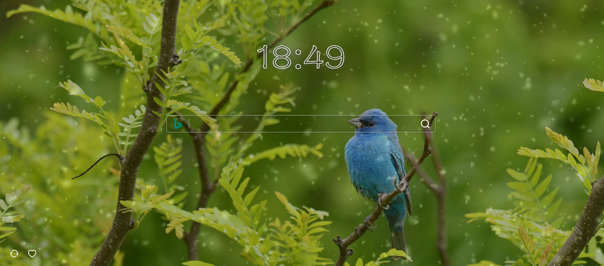
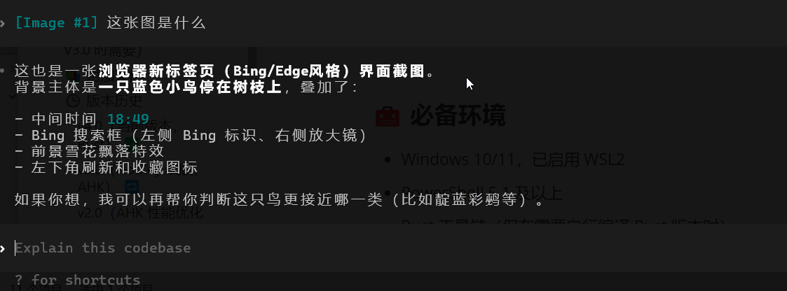
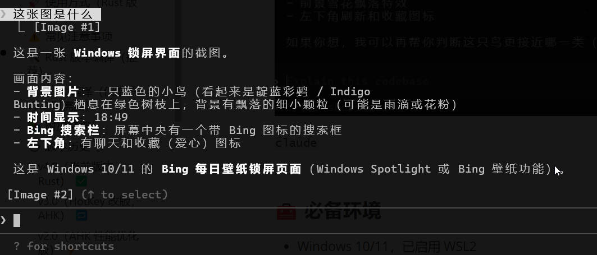
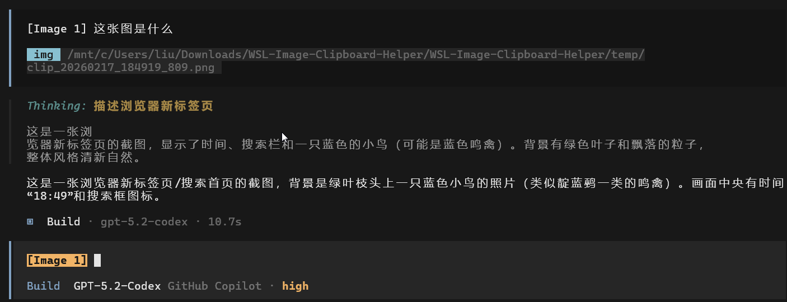

<a id="wsl-image-clipboard-helper"></a>

<p align="center">
  
</p>

<h1 align="center">WSL Image Clipboard Helper</h1>

<p align="center">
  One hotkey to turn Windows clipboard images into WSL-ready paths for AI CLI tools.
</p>

<p align="center">
  <a href="https://github.com/cpulxb/WSL-Image-Clipboard-Helper/releases/latest">Release</a>
  ·
  <a href="#中文说明">中文</a>
  ·
  <a href="#english-guide">English</a>
</p>

---

## 中文说明 🇨🇳

### 📌 概述

#### 🌍 背景
当前许多智能编程 CLI Agent（如 Codex、Amazon Q Developer CLI、OpenCode、Claude Code 等）主要针对 Linux 和 macOS 系统优化，Windows 用户想要体验这些工具，通常需要通过 WSL2（Windows Subsystem for Linux 2）来运行。然而，WSL2 在某些能力上的支持并不完善，图片粘贴就是其中一个典型痛点：

- 问题：WSL2 终端无法直接访问 Windows 剪贴板中的图片数据
- 影响：用户无法像在原生 Linux/macOS 中那样，直接把截图粘贴给 AI 工具分析
- 现状：部分 AI CLI 工具通过“保存图片到文件 -> 传递文件路径”的方式变相支持图片输入

#### ✅ 解决方案
本工具用于弥补这个缺口：通过全局快捷键（默认 `Alt+V`），自动读取 Windows 剪贴板图片，保存到本地 `temp/` 目录，并把对应 WSL 路径（`/mnt/c/...`）粘贴到当前输入窗口，让 AI 工具可以直接消费图片文件。

当前主版本是 Rust 实现（`v4.0`）。推荐直接下载 GitHub Release `v4.0` 或 latest release 中的预编译版本。

### ✨ 核心特性

- 🚀 即时路径输出：触发热键后优先粘贴 `/mnt/...` 路径，减少等待时间
- ⚡ 图片异步保存：路径先可用，图片文件后台写入，降低主流程阻塞
- 🌐 输入法保护（兼容模式）：粘贴前把前台窗口切到直接输入英文，结束后自动恢复；默认不改动系统键盘布局，可在托盘彻底关闭
- 🧹 自动清理机制：周期清理过期 PNG，退出时清理临时图片
- 🖱️ 托盘管理：支持切换热键、切换运行模式、打开临时图片目录、退出并清理临时图片
- 🛡️ 图片读取边界保护：对 DIB 头与内存大小做安全校验，避免异常数据导致崩溃
- 🪟 Windows 集成：内嵌多尺寸图标，并带 DPI-aware manifest，高 DPI 环境显示更稳定
- 📁 Explorer 路径转换：在资源管理器复制文件后按 `Alt+V`，会粘贴对应 `/mnt/...` 路径
- 🎯 路径格式可切换：纯路径 / `@` 前缀（适配 Kimi Code CLI、Gemini CLI、Qwen Code）/ 引号包裹
- 🌐 远程粘贴（SSH）：在终端里 ssh 到远程机器跑 Codex / Claude Code 时，自动识别当前 ssh 会话，图片先上传到远程再粘贴远程路径，无需任何配置



以这张图为例子，粘贴到Codex,Claude Code,OpenCode均正常(其他Agent工具可自行尝试)，粘贴的时候会自动识别成`[Image #n]` 的这种格式，不能转换成这个格式的时候，就会以路径的形式显示在输入框中

`codex`



`claude`



`openCode`



### 🧰 必备环境

- Windows 10/11，已启用 WSL2
- PowerShell 5.1 及以上
- Rust 工具链（仅在需要自行编译 Rust 版本时）
- AutoHotkey v2（仅在维护旧版 AHK 流程或自编 AHK 可执行文件时）

### 🗂️ 目录结构

```text
WSL-Image-Clipboard-Helper/
├── README.md
├── docs/                    # 文档记录
│   ├── architecture_by_codex.md
│   ├── terminal-ctrl-v-interception.md
│   └── rust-refactor-v3-v4.md
├── rust/                    # rust重构版本
│   ├── Cargo.toml
│   ├── Cargo.lock
│   ├── wsl_clipboard.toml
│   └── src/                 # rust重构版本核心代码
├── scripts/                 # AHK 相关脚本与历史可执行文件
```

### 🚀 使用方式（Rust 版本）

1. 最简单方式（推荐）：从 GitHub Release 下载已编译版本：
   - `v4.2`：[https://github.com/cpulxb/WSL-Image-Clipboard-Helper/releases/tag/v4.2](https://github.com/cpulxb/WSL-Image-Clipboard-Helper/releases/tag/v4.2)
   - latest release：[https://github.com/cpulxb/WSL-Image-Clipboard-Helper/releases/latest](https://github.com/cpulxb/WSL-Image-Clipboard-Helper/releases/latest)

2. 将下载的 `wsl_clipboard.exe` 放到一个固定目录。

   Releases 压缩包中文件目录

   ```
   WSL-Image-Clipboard-Helper/
   ├── wsl_clipboard.exe        # 推荐直接使用的预编译可执行文件（rust版本)
   ├── temp/                    # 运行时临时图片目录
   ├── wsl_clipboard.toml       # 运行时自动生成，存储相关配置，不要删除
   ```

3. 双击启动 `wsl_clipboard.exe`。

4. 在任意可编辑输入框按下快捷键（默认 `Alt+V`）：
   - 有图片：保存到 `temp/`，并粘贴 `/mnt/...` 路径
   - 无图片：自动回退普通粘贴（`Ctrl+V`）
   - 在 Explorer 中先复制文件，再按 `Alt+V`：粘贴转换后的 WSL 路径（例如 `/mnt/c/...`）

5. 通过托盘菜单切换热键与运行模式。

6. 退出时从托盘菜单选择 `退出并清理临时图片`，会删除 `temp/` 下的临时 PNG 文件。

如需自行编译，再使用下面的源码方式：

1. 克隆仓库并进入目录：
   ```bash
   git clone https://github.com/cpulxb/WSL-Image-Clipboard-Helper.git
   cd WSL-Image-Clipboard-Helper
   ```
2. 按下文“Rust 版本编译（推荐）”完成编译。
3. 启动编译产物 `wsl_clipboard.exe`。

### ⚠️ 常见注意事项

- 默认热键是 `Alt+V`，可在托盘菜单中切换为 `Ctrl+Alt+V` 或 `Alt+Enter`
- 运行配置保存在 `wsl_clipboard.toml`（与可执行文件同目录）
- 托盘菜单中的 `退出并清理临时图片` 会删除 `temp/` 下的临时 PNG 文件
- 若遇到输入法导致的粘贴错乱，切回 `兼容模式（输入法保护）`
- 不希望本工具碰输入法，可在托盘 `输入法保护` 中选择 `关闭（不干预输入法）`
- 若托盘图标未显示，请检查任务栏隐藏图标区域
- 默认粘贴纯路径；Kimi 等需要 `@` 文件引用的 CLI，请在托盘菜单切换 `路径格式`
- 在终端里 ssh 到远程机器跑 CLI 时，热键会自动把图片传到远程再粘贴远程路径；前提是该主机能用公钥免密登录，见下文

### 🌐 远程粘贴（SSH）

适用场景：你在 Windows Terminal / WSL 里 `ssh` 到一台远程服务器，在上面运行 Codex、Claude Code 等 CLI（[issue #11](https://github.com/cpulxb/WSL-Image-Clipboard-Helper/issues/11)）。此时本地 `/mnt/c/...` 路径在远程不可见，热键会先把图片传过去、再粘贴远程路径。

**用法和本地完全一样：在远程终端的 CLI 输入框按热键即可，不需要任何配置。** 程序会在按下热键时自动枚举当前打开的 ssh 会话（Windows 侧的 `ssh.exe` 和 WSL 里的 `ssh` 都算），找出**你正在粘贴的那个终端 tab** 里的会话，复用那条会话的 ssh 参数（用户、主机、端口、`-i` 密钥、`-J` 跳板、`~/.ssh/config` 别名等）新建一条连接上传图片，然后粘贴远程绝对路径（如 `/tmp/wsl_clipboard-1000/clip_20260917_120000_123.png`），CLI 照常识别成 `[Image #n]`。`路径格式`（`@` 前缀 / 引号）同样生效。

唯一前提：**该主机要能用公钥免密登录**。程序没有控制台，新建的 ssh 连接无法输入密码。如果你平时是敲密码登录的，每台主机做一次（Windows 侧 PowerShell 示例，会要一次密码）：

```powershell
type $env:USERPROFILE\.ssh\id_ed25519.pub | ssh user@host "mkdir -p ~/.ssh && cat >> ~/.ssh/authorized_keys"
```

没有密钥就先 `ssh-keygen -t ed25519`；从 WSL 侧 ssh 的话用 `ssh-copy-id user@host`。之后你平时登录也不用再输密码。

托盘菜单 `远程粘贴（SSH）`：

| 菜单项 | 行为 |
| --- | --- |
| `自动（当前 tab 是 ssh 才上传）`（默认） | 当前 tab 里有 ssh 会话就上传到它；本地 tab（或其他非终端程序）里按热键仍和以前一样粘贴本地 `/mnt` 路径 |
| `关闭（始终粘贴本地 /mnt 路径）` | 完全不做远程上传（持久化到 `wsl_clipboard.toml` 的 `remote_paste = false`） |
| 列出的各个会话 | 固定往这个会话传，不管当前在哪个 tab（自动判断不准时用；仅本次运行有效） |

注意事项：

- 只有**交互式登录**的 ssh 会被识别；`ssh -N` 端口转发、VS Code Remote-SSH（`-T`）、git 等带远程命令且没有 `-t` 的进程会被忽略，不会误触发。
- 同一个 Windows Terminal 窗口里本地 tab 和 ssh tab 并存时，按热键前所在的 tab 决定粘本地路径还是上传。判断方法是给各 tab 的标题临时追加一个不可见的零宽字符、看窗口标题变成哪个，随即还原，不影响显示。判断不出具体 tab 时（profile 开了 `suppressApplicationTitle`、VS Code 等其他终端、WSL 里的 ssh 跑在 tmux / screen 中），退回为“前台程序里最近打开的 ssh 会话”；这种情况下若粘错，可在托盘里固定会话或关闭远程粘贴。
- WSL 侧只枚举默认发行版里的 ssh；Windows 侧枚举所有 `ssh.exe`（含 Git 附带的），上传时复用发现到的那个可执行文件及其配置。
- 上传目录固定为远程的 `/tmp/wsl_clipboard-<uid>/`，不存在会自动创建；传输只用一条 ssh 连接（远程执行 `mkdir -p DIR && cat > DIR/FILE`，文件走 stdin），不依赖远程装有 `scp` / `sftp-server`。每次粘贴多出一次 ssh 建连的耗时（通常零点几秒到一两秒）。
- 上传失败（认证失败、主机不可达、超时等）会弹托盘气泡提示原因，并且**不粘贴任何内容**。
- 同一张截图重复粘贴不会重复上传；程序退出时会删除本次会话上传到远程的临时截图，与本地 `temp/` 清理策略一致。
- 在 Explorer 复制文件后按热键，文件同样会上传并粘贴远程路径（不支持目录）。

### ⌨️ 输入法保护策略

仅在 `运行模式 = 兼容模式` 时生效，可在托盘 `输入法保护` 子菜单切换，或直接改 `wsl_clipboard.toml` 的 `ime_protection`：

| 取值 | 行为 | 是否会改动系统输入法列表 |
| --- | --- | --- |
| `off` | 完全不干预输入法 | 否 |
| `imm`（默认） | 仅关闭前台窗口的 IME 输入状态（切到直接输入），粘贴后恢复 | 否 |
| `layout` | 切换到英文键盘布局，但**只复用**系统里已安装的英文布局；没有就跳过 | 否 |
| `layout-force` | 找不到英文布局时才加载 `ENG`（不激活），并在退出时自动卸载 | 仅此项可能临时新增 |

> 自 v4.1.3 起，程序**不再于启动时预加载英文键盘布局**。旧版本会在启动瞬间无条件调用
> `LoadKeyboardLayoutW("00000409", KLF_ACTIVATE)`，把英文布局登记进系统输入法列表，
> 导致 `Win + Space` 里凭空多出 `ENG / English (United States)`（[issue #10](https://github.com/cpulxb/WSL-Image-Clipboard-Helper/issues/10)）。

### ❓ 常见问题（FAQ）

**Q1：为什么有时显示 `[Image #1]`，有时却直接显示 `/mnt/...` 路径？**（[issue #4](https://github.com/cpulxb/WSL-Image-Clipboard-Helper/issues/4)）

CLI Agent（Claude Code / Codex / OpenCode 等）收到粘贴文本的瞬间会检查该路径的文件是否已存在：存在就渲染成 `[Image #n]` 并直接作为图片附件（无需申请读取权限）；不存在或识别失败就原样留下路径文本，之后 Agent 只能用读文件工具去访问（触发权限申请；若 Agent 跑在 Windows 原生环境而非 WSL，还可能因不认识 `/mnt/c/...` 而再转换一次 Windows 路径，出现"二次申请"）。

v4.0 及更早版本采用"先粘路径、后台再保存图片"的顺序，系统卡顿时文件落盘晚于 CLI 的检查，就会偶发直接显示路径。v4.1 起改为"先落盘、再粘贴"，从根本上消除该竞态。若仍偶发，请确认终端支持 bracketed paste（Windows Terminal 默认支持），并且 Agent 运行在 WSL 内。

**Q2：按了热键，图片保存了、输入法也切换了，但哪里都粘不出文本？**（[issue #2](https://github.com/cpulxb/WSL-Image-Clipboard-Helper/issues/2)）

按可能性从高到低排查：

1. **在用 v3.0 AHK 版本（或自行改编译的版本）**：旧版粘贴后固定 80ms 就把剪贴板恢复成原图片，目标窗口响应稍慢时读到的已是恢复后的图片数据，表现为"任何地方都粘不出文本"。请升级到 v4.x Rust 版本（已移除该竞态）。
2. **目标窗口以管理员权限运行**（如管理员终端），而本工具未提权：Windows UIPI 会静默拦截模拟按键。请以管理员身份运行本工具。
3. **热键修饰键未松开**：Alt 未抬起时注入的 Ctrl+V 会被识别成 Ctrl+Alt+V 而失效。v4.1 增加了物理按键释放等待与 Alt 菜单屏蔽键，已大幅缓解。
4. **安全软件拦截模拟键盘输入**（SendInput）：请将本工具加入白名单。

**Q3：Kimi Code CLI 里粘贴路径没有变成图片？**（[issue #5](https://github.com/cpulxb/WSL-Image-Clipboard-Helper/issues/5)）

Kimi Code CLI 不会把纯文本路径自动识别为图片，但支持 `@文件` 引用语法。在托盘菜单把 `路径格式` 切换为 `@ 路径（Kimi/Gemini/Qwen）`，热键会粘贴 `@/mnt/c/... `（带尾随空格），Kimi Code CLI / Gemini CLI / Qwen Code 即可把它作为文件引用消费。

另外注意：Kimi Code CLI 在 Windows 端自带 `Alt+V` 贴图快捷键，与本工具默认热键相同。本工具注册的是系统级全局热键、会优先生效；若想保留 Kimi 原生行为，可在托盘把本工具热键换成 `Ctrl+Alt+V`。

**Q4：路径里有空格，粘贴后被命令行截断？**

把 `路径格式` 切换为 `引号路径`，粘贴时会用双引号包裹每个路径。

**Q5：启动本工具后，`Win + Space` 里多出了 `ENG / English (United States)`？**（[issue #10](https://github.com/cpulxb/WSL-Image-Clipboard-Helper/issues/10)）

v4.1.2 及更早版本在启动时就无条件执行 `LoadKeyboardLayoutW("00000409", KLF_ACTIVATE)` 预加载英文布局。`LoadKeyboardLayoutW` 会把该布局登记进**系统**的输入法列表，`KLF_ACTIVATE` 还会立即激活它，于是即使你的语言列表里从没添加过英语，工具一启动就会多出 `ENG`，任务栏输入法图标也被重新唤出。

v4.1.3 起：

- 启动阶段不再做任何键盘布局操作
- 英文布局改为**惰性解析**，且默认只在系统已装的布局里复用，绝不擅自新增
- 默认策略换成 `imm`：只关闭前台窗口的 IME 输入状态，完全不触碰键盘布局
- 确需加载时（`ime_protection = "layout-force"`）不再使用 `KLF_ACTIVATE`，并改用 `KLF_NOTELLSHELL` 避免唤出任务栏指示器，退出时自动 `UnloadKeyboardLayout`
- 新增 `ime_protection = "off"`，可彻底关闭输入法保护

如果你此前被旧版本影响，系统语言列表里已经留下了英语（美国），需要到 `设置 → 时间和语言 → 语言和区域` 手动删除一次；新版本不会再添加它。

**Q6：我是 ssh 到远程服务器上跑 Codex 的，能直接粘贴图片吗？**（[issue #11](https://github.com/cpulxb/WSL-Image-Clipboard-Helper/issues/11)）

可以，v4.2 起支持，且不需要配置：按热键时程序会自动找到你当前打开的 ssh 会话（无论是从 Windows 侧还是 WSL 侧 ssh 的），用同样的参数把图片上传到远程，再粘贴远程路径。唯一前提是这台主机能用公钥免密登录（程序没有控制台，无法替你输密码）；平时敲密码登录的话，先把本机公钥加进远程 `~/.ssh/authorized_keys`（每台主机一次）。详见上文「远程粘贴（SSH）」。

### 🛠️ Rust 版本编译（推荐）

在仓库根目录执行：

```bash
cd rust
cargo build --release --target x86_64-pc-windows-msvc
```

编译产物：

```text
rust/target/x86_64-pc-windows-msvc/release/wsl_clipboard.exe
```

调试构建：

```bash
cd rust
cargo build --target x86_64-pc-windows-msvc
```

清理构建产物：

```bash
cd rust
cargo clean
```

在非 Windows 宿主（Linux/macOS）上执行 `cargo check` / `cargo clippy` 前，需先安装交叉编译 target（`rust/.cargo/config.toml` 默认指向 `x86_64-pc-windows-msvc`）：

```bash
rustup target add x86_64-pc-windows-msvc
```

### 🔧 AHK 编译（仅维护 V3.0 时需要）

如果你在维护 `v3.0` 的 AHK 分支，可用 Ahk2Exe 重新编译：

1. 安装 AutoHotkey v2：  
   [https://www.autohotkey.com/download/ahk-v2.exe](https://www.autohotkey.com/download/ahk-v2.exe)
2. 打开 `C:\Program Files\AutoHotkey\Compiler\Ahk2Exe.exe`
3. Source 选择 `scripts/wsl_clipboard.ahk`
4. Destination 选择输出路径（例如 `scripts/wsl_clipboard.exe`）
5. Base File 建议使用 `AutoHotkey64.exe`

### 📚 附加文档

- [技术架构与流程说明](docs/architecture_by_codex.md)
- [V3.0/V4.0 重构说明](docs/rust-refactor-v3-v4.md)
- [v4.1 终端图片粘贴场景实测报告](docs/paste-scenario-test-report.md)

### 🕒 版本历史

#### v4.2（当前版本，Rust） ✅

- 新增 `远程粘贴（SSH）`：在终端里 ssh 到远程机器运行 CLI 时，图片先通过 ssh 上传到远程，再粘贴远程路径（#11）
- 零配置：按热键时自动枚举当前打开的 ssh 会话（Windows 侧 `ssh.exe` 与 WSL 侧 `ssh`），复用其用户 / 主机 / 端口 / 密钥 / 跳板 / 别名参数；只识别交互式登录会话，`-N` 隧道、VS Code Remote-SSH、git 等不会误触发
- 托盘子菜单可在 `自动` / `关闭` 间切换（`remote_paste` 配置项），多个 ssh tab 时可手动指定会话
- 单连接传输（`mkdir -p && cat > FILE`，stdin 流式）到远程 `/tmp/wsl_clipboard-<uid>/`；Explorer 复制的文件同样上传
- 同图重复粘贴不重复上传；退出时清理本会话上传的远程临时截图；上传失败弹托盘气泡且不粘贴
- ssh 以 `BatchMode=yes` / `ConnectTimeout=5` 运行并有 60 秒总超时，且以 `CREATE_NO_WINDOW` 启动，不会闪出控制台窗口

#### v4.1.3（Rust） ✅

- 修复启动后系统输入法列表凭空多出 `ENG / English (United States)` 的问题：不再于启动时无条件调用 `LoadKeyboardLayoutW("00000409", KLF_ACTIVATE)`（#10）
- 英文布局改为惰性解析，默认只复用系统已装布局；确需加载时不再使用 `KLF_ACTIVATE`，并在退出时自动卸载
- 新增 `输入法保护` 托盘选项与 `ime_protection` 配置项：`off` / `imm`（新默认，零副作用）/ `layout` / `layout-force`
- 与前台窗口 IME 的通信改用带超时的 `SendMessageTimeoutW`，避免无响应窗口拖住粘贴路径

#### v4.1.2（Rust） ✅

- 修复快速松开 Alt 时粘贴被目标窗口菜单栏吃掉的问题：热键触发后立即注入屏蔽键，若前台已进入菜单模式则先发 Esc 退出再粘贴（#2）

#### v4.1.1（Rust） ✅

- 修复 32 位剪贴板 DIB 的保留字节（全 0）被当作 alpha 导致保存的 PNG 全透明的问题：alpha 全 0 时按不透明处理（与浏览器对剪贴板 DIB 的启发式一致）

#### v4.1（Rust） ✅

- 修复偶发"粘贴出原始路径而非 `[Image #n]`"：改为图片先落盘、路径后粘贴，消除文件存在性竞态（#4）
- 新增 `路径格式` 托盘选项：纯路径 / `@` 前缀 / 引号包裹，适配 Kimi Code CLI、Gemini CLI、Qwen Code 等（#5）
- 粘贴按键注入加固：等待物理修饰键释放、增加 Alt 菜单屏蔽键并释放右 Alt，降低"粘贴无内容"概率（#2）
- 支持在非 Windows 宿主上执行 `cargo check`/`cargo clippy`（自动跳过资源嵌入）
- README 新增 FAQ 排障章节

#### v4.0（Rust） ✅

- 主流程迁移到 Rust，可维护性更高
- 修复 DIB 像素偏移解析问题，提升图片兼容性
- 增加剪贴板内存边界校验，避免越界读取风险
- 热键切换加入回滚机制，避免切换失败后无热键可用
- 异常分支补齐剪贴板释放，降低资源占用风险
- 内嵌多尺寸应用图标，并增加 DPI-aware manifest
- 支持 Explorer 复制文件后用 `Alt+V` 转换并粘贴 `/mnt/...` 路径

#### v3.0（HotKey 改版，AHK） 🔁

- 仍基于 AHK 体系
- 重点优化热键体验与可配置性
- 托盘交互进一步完善

#### v2.0（AHK 性能优化版） ⚡

- 路径优先异步保存，体感延迟明显下降
- 引入输入法保护和自动清理机制

#### v1.0 🧱

- 基础剪贴板图片同步能力
- SHA256 去重与缓存管理

---

## English Guide 🌐

### 📌 Overview

#### 🌍 Background
Many AI CLI agents (Codex, Amazon Q Developer CLI, OpenCode, Claude Code, etc.) are optimized for Linux/macOS workflows. On Windows, users usually rely on WSL2, but clipboard image handling is still a practical gap:

- Problem: WSL2 terminals cannot directly consume image bytes from Windows clipboard
- Impact: screenshot-to-agent flow is less direct than native Linux/macOS
- Workaround: save image to file and pass file path to the tool

#### ✅ Solution
This project automates that workaround with a global hotkey (default `Alt+V`): it captures clipboard image data, saves a PNG file, and pastes the WSL path (`/mnt/...`) into the active input control.

Current mainline release is Rust-based (`v4.0`). The recommended path is to download the prebuilt GitHub Release `v4.0` or the latest release.

### ✨ Highlights

- 🚀 Fast path-first paste workflow
- ⚡ Async image persistence
- 🌐 IME guard in compatibility mode — closes the foreground IME before pasting and restores it afterwards, without altering system keyboard layouts (switchable, and fully disableable)
- 🖱️ Tray-based hotkey and mode switching
- 🧹 Automatic cleanup for temporary PNG files
- 🛡️ Safer clipboard parsing with memory-bound checks
- 🪟 Embedded multi-size app icons and a DPI-aware manifest
- 📁 Explorer file path conversion: copy files in Explorer, then press `Alt+V` to paste `/mnt/...` paths
- 🎯 Switchable path style: plain / `@`-prefixed (for Kimi Code CLI, Gemini CLI, Qwen Code) / quoted
- 🌐 Remote paste over SSH: when the CLI runs on a remote host you `ssh` into, the helper detects the open SSH session automatically, uploads the image and pastes the remote path — zero configuration


Using this image as an example, pasting works correctly in Codex, Claude Code, and OpenCode (you can also try other agent tools). During paste, many tools render it as `[Image #n]`; when that rendering path is unavailable, the input falls back to showing the file path in the text box.

`codex`


`claude`


`openCode`


### 🧰 Requirements

- Windows 10/11 with WSL2
- PowerShell 5.1+
- Rust toolchain (for building Rust version)
- AutoHotkey v2 (only for maintaining AHK-based `v3.0`)

### 🗂️ Directory Structure

```text
WSL-Image-Clipboard-Helper/
├── README.md
├── docs/
│   ├── architecture_by_codex.md
│   ├── terminal-ctrl-v-interception.md
│   └── rust-refactor-v3-v4.md
├── rust/
│   ├── Cargo.toml
│   ├── Cargo.lock
│   ├── wsl_clipboard.toml
│   └── src/
├── scripts/                 # AHK scripts and legacy executable
├── temp/                    # runtime temporary image directory
└── wsl_clipboard.exe        # recommended prebuilt executable
```

### 🚀 Usage (Rust version)

1. Easiest way (recommended): download the prebuilt package from GitHub Releases:
   - `v4.2`: [https://github.com/cpulxb/WSL-Image-Clipboard-Helper/releases/tag/v4.2](https://github.com/cpulxb/WSL-Image-Clipboard-Helper/releases/tag/v4.2)
   - latest release: [https://github.com/cpulxb/WSL-Image-Clipboard-Helper/releases/latest](https://github.com/cpulxb/WSL-Image-Clipboard-Helper/releases/latest)
2. Put `wsl_clipboard.exe` in a fixed folder (ideally with `temp/` and `wsl_clipboard.toml`).
3. Launch `wsl_clipboard.exe`.
4. Press hotkey (default `Alt+V`) in any editable field:
   - With image in clipboard: save to `temp/` and paste the `/mnt/...` path.
   - Without image in clipboard: automatically fall back to normal paste (`Ctrl+V`).
   - In Explorer, copy one or more files, then press `Alt+V` to paste their WSL paths, such as `/mnt/c/...`.
5. Use the tray menu for hotkey/mode switch and choose `Exit and clean temporary images` when exiting.

### ⚠️ Notes

- The default hotkey is `Alt+V`; the tray menu can switch it to `Ctrl+Alt+V` or `Alt+Enter`.
- Runtime settings are stored in `wsl_clipboard.toml` next to the executable.
- `Exit and clean temporary images` removes temporary PNG files under `temp/`.
- If IME state causes paste issues, switch back to `Compatibility mode (IME guard)`.
- To stop the helper from touching your IME at all, pick `关闭（不干预输入法）` under the tray `输入法保护` (IME guard) submenu.
- If the tray icon is not visible, check the hidden icons area in the Windows taskbar.
- Plain paths are pasted by default; for CLIs that need `@` file references (e.g. Kimi Code CLI), switch `路径格式` (path style) in the tray menu.
- If the CLI runs on a remote host over SSH, the hotkey uploads the image there and pastes the remote path automatically; the host must accept key-based login — see below.

### 🌐 Remote paste over SSH

For the case where you `ssh` from Windows Terminal / WSL into a server and run Codex, Claude Code, etc. **there** ([issue #11](https://github.com/cpulxb/WSL-Image-Clipboard-Helper/issues/11)). A local `/mnt/c/...` path is meaningless on the remote side, so the hotkey uploads the image first and pastes the remote path.

**It works exactly like local paste: press the hotkey in the CLI's input box inside the remote terminal. No configuration needed.** On each hotkey press the helper enumerates the SSH sessions currently open (both Windows-side `ssh.exe` and `ssh` inside WSL), picks the one in **the terminal tab you are pasting into**, reuses that session's SSH arguments (user, host, port, `-i` key, `-J` jump host, `~/.ssh/config` alias, …) to open one more connection for the upload, then pastes the absolute remote path (e.g. `/tmp/wsl_clipboard-1000/clip_20260917_120000_123.png`), which the CLI renders as `[Image #n]` as usual. The `路径格式` (path style) setting still applies.

The one prerequisite: **the host must accept key-based (passwordless) login.** The helper has no console, so the extra connection cannot type a password. If you normally log in with a password, do this once per host (Windows-side PowerShell example; it asks for the password one last time):

```powershell
type $env:USERPROFILE\.ssh\id_ed25519.pub | ssh user@host "mkdir -p ~/.ssh && cat >> ~/.ssh/authorized_keys"
```

Run `ssh-keygen -t ed25519` first if you have no key; from the WSL side simply use `ssh-copy-id user@host`. Your regular logins stop asking for a password too.

Tray submenu `远程粘贴（SSH）` (remote paste):

| Item | Behaviour |
| --- | --- |
| `自动（当前 tab 是 ssh 才上传）` — auto (default) | Upload only when the terminal tab you are pasting into runs an SSH session; in a local tab (or any non-terminal app) paste the local `/mnt` path as before |
| `关闭（始终粘贴本地 /mnt 路径）` — off | Never upload (persisted as `remote_paste = false` in `wsl_clipboard.toml`) |
| the listed sessions | Always upload to this session, whichever tab is active (a fallback when auto detection guesses wrong; for this run only) |

Notes:

- Only **interactive login** sessions are detected; `ssh -N` port forwards, VS Code Remote-SSH (`-T`), git and other invocations that run a remote command without `-t` are ignored, so they never trigger an upload.
- With a local tab and an SSH tab side by side in one Windows Terminal window, the tab you press the hotkey in decides between the local path and an upload. The helper tells tabs apart by briefly appending an invisible zero-width character to each tab's title, seeing which one the window title picks up, and restoring it right away. When the tab cannot be determined (profile has `suppressApplicationTitle`, VS Code or other terminals, WSL `ssh` inside tmux/screen), it falls back to the most recently opened SSH session of the foreground app; pin a session or turn remote paste off in the tray if that guesses wrong.
- On the WSL side only the default distro is scanned; on the Windows side every `ssh.exe` (including the one bundled with Git) is considered, and the upload reuses the very executable and configuration that session uses.
- Files land in `/tmp/wsl_clipboard-<uid>/` on the remote host (created on demand). A single SSH connection does the transfer (`mkdir -p DIR && cat > DIR/FILE` with the file streamed via stdin), so `scp`/`sftp-server` are not required. Each paste costs one SSH connection setup (typically well under two seconds).
- If the upload fails (auth failure, host unreachable, timeout…) a tray balloon shows the reason and **nothing is pasted**.
- Re-pasting the same screenshot does not upload it again; temporary screenshots uploaded during the session are deleted from the remote host on exit, mirroring the local `temp/` cleanup.
- Files copied in Explorer are uploaded the same way and their remote paths are pasted (directories are not supported).

### ⌨️ IME guard strategies

Effective only in compatibility mode. Switch it in the tray `输入法保护` submenu, or set `ime_protection` in `wsl_clipboard.toml`:

| Value | Behaviour | Touches the system IME list? |
| --- | --- | --- |
| `off` | Never touches the IME | No |
| `imm` (default) | Only closes the foreground window's IME open status, restoring it after the paste | No |
| `layout` | Switches to an English keyboard layout, but **only reuses** one already installed; skips otherwise | No |
| `layout-force` | Loads `ENG` on demand (without activating it) and unloads it on exit | Only this one, temporarily |

### ❓ FAQ

**Q1: Why do I sometimes get `[Image #1]` and sometimes a literal `/mnt/...` path?** ([issue #4](https://github.com/cpulxb/WSL-Image-Clipboard-Helper/issues/4))

CLI agents check whether the pasted path exists **at the moment the paste arrives**; if the file is there, it renders as an `[Image #n]` attachment, otherwise the raw path stays as text and the agent later needs file-read permission (and possibly a Windows-path retry when it runs outside WSL). Versions up to v4.0 pasted the path first and saved the PNG in the background, so under load the file could land after the check. Since v4.1 the image is written to disk **before** the path is pasted, removing that race.

**Q2: Hotkey fires, the PNG appears in `temp/`, IME switches — but no text is pasted anywhere.** ([issue #2](https://github.com/cpulxb/WSL-Image-Clipboard-Helper/issues/2))

Most likely causes, in order: (1) you are on the v3.0 AHK build, which restored the clipboard 80 ms after pasting — slow target windows read the restored image instead of the path text; upgrade to v4.x. (2) The target window runs elevated while the helper does not — Windows UIPI silently drops injected keys; run the helper as administrator. (3) Hotkey modifiers still held — injected Ctrl+V turns into Ctrl+Alt+V; v4.1 waits for physical key release and adds an Alt menu-mask key. (4) Security software blocking `SendInput`.

**Q3: Kimi Code CLI does not turn the pasted path into an image.** ([issue #5](https://github.com/cpulxb/WSL-Image-Clipboard-Helper/issues/5))

Kimi Code CLI does not auto-detect plain path text, but it supports `@file` references. Switch the tray `路径格式` (path style) to the `@` option and the hotkey pastes `@/mnt/c/... ` (with a trailing space), which Kimi Code CLI / Gemini CLI / Qwen Code consume as a file reference. Note Kimi's own Windows build binds `Alt+V` for clipboard images; this helper's global hotkey takes priority, so switch one of them (e.g. this helper to `Ctrl+Alt+V`) if you want both behaviors.

**Q4: Paths containing spaces get cut off in the shell.**

Switch the path style to the quoted option; every path is then wrapped in double quotes.

**Q5: After launching the helper, an extra `ENG / English (United States)` shows up in `Win + Space`.** ([issue #10](https://github.com/cpulxb/WSL-Image-Clipboard-Helper/issues/10))

Up to v4.1.2 the helper called `LoadKeyboardLayoutW("00000409", KLF_ACTIVATE)` unconditionally **at startup**. `LoadKeyboardLayoutW` registers the layout with the **system** input list and `KLF_ACTIVATE` activates it right away, so `ENG` appeared — and the taskbar IME indicator came back — even for users who never added English to their language list.

Since v4.1.3 the helper performs no keyboard-layout work at startup, resolves the English layout lazily, and by default only reuses layouts the system already has. The new default strategy `imm` never touches keyboard layouts at all; `layout-force` no longer uses `KLF_ACTIVATE`, passes `KLF_NOTELLSHELL`, and calls `UnloadKeyboardLayout` on exit. Set `ime_protection = "off"` to disable the guard entirely.

If an earlier version already left English (United States) in your language list, remove it once under `Settings → Time & language → Language & region`; the new build will not add it back.

**Q6: I run Codex on a remote server over SSH — can I still paste images?** ([issue #11](https://github.com/cpulxb/WSL-Image-Clipboard-Helper/issues/11))

Yes, since v4.2, with no configuration: on each hotkey press the helper finds the SSH session you currently have open (whether started from the Windows side or from inside WSL), uploads the image with the same SSH arguments and pastes the remote path. The only prerequisite is key-based passwordless login to that host (the helper has no console to type a password); if you log in with a password today, add your public key to the remote `~/.ssh/authorized_keys` once per host. See "Remote paste over SSH" above.

If you prefer building from source:

1. Clone repository:
   ```bash
   git clone https://github.com/cpulxb/WSL-Image-Clipboard-Helper.git
   cd WSL-Image-Clipboard-Helper
   ```
2. Build with the commands in the next section.
3. Launch the built `wsl_clipboard.exe`.

### 🛠️ Build (Rust)

```bash
cd rust
cargo build --release --target x86_64-pc-windows-msvc
```

Binary output:

```text
rust/target/x86_64-pc-windows-msvc/release/wsl_clipboard.exe
```

Clean build artifacts:

```bash
cd rust
cargo clean
```

### 🕒 Version Line

- `v4.2`: remote paste over SSH — auto-detects the open SSH session (Windows-side `ssh.exe` or WSL-side `ssh`), uploads the image with the same SSH arguments and pastes the remote path; tray auto/off/pin switch and remote cleanup on exit (#11)
- `v4.1.3`: no more phantom `ENG` keyboard layout on startup — lazy English-layout resolution plus the new `ime_protection` setting (#10)
- `v4.1.2`: dismiss the target window's menu mode (fast Alt release) before injecting Ctrl+V so pastes are not swallowed
- `v4.1.1`: treat all-zero alpha in 32-bit clipboard DIBs as opaque so saved PNGs are not fully transparent
- `v4.1`: save-before-paste ordering fix (#4), switchable path style incl. `@` references for Kimi/Gemini/Qwen (#5), hardened key injection (#2)
- `v4.0`: Rust mainline release with embedded multi-size icons, DPI-aware manifest, and Explorer-to-WSL path paste
- `v3.0`: Hotkey-focused revision on AHK
- `v2.0`: AHK path-first optimization
- `v1.0`: AHK baseline

### 📚 Additional Resources

- [Architecture & Workflow Details](docs/architecture_by_codex.md)
- [V3.0/V4.0 Refactor Notes](docs/rust-refactor-v3-v4.md)
